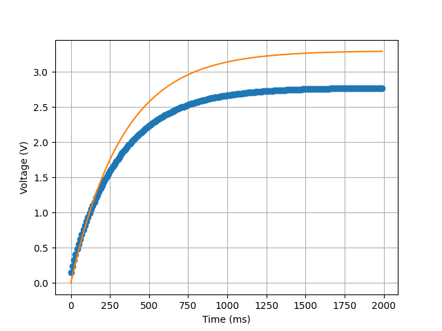

The program "GUI.py" creates a GUI and plot for a step response to an RC circuit.  The program collects serial data from the nucleo microcontroller which is running "step_response.py" to generate a step response on the RC circuit.  The serial data is then plotted using the matplotlib library and features a GUI with a run, clear, and quit button to run the step response, clear the plot, and quit the program respectively.  The program plots the data from the microcontroller as well as a theoretical step response.  This plot can be found below, with the microcontroller response represented as "o" and the theoretical response represented as a straight line.

